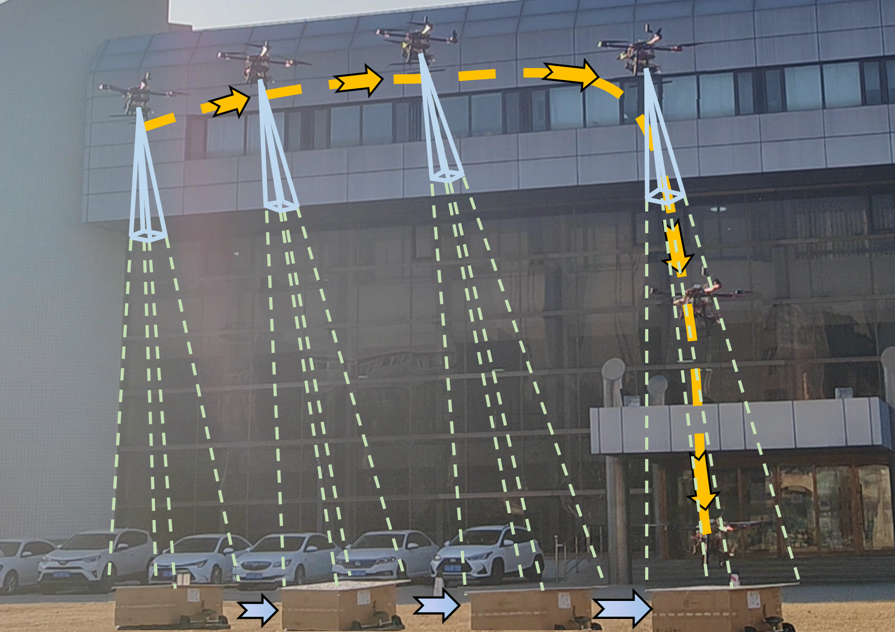

 
<h1 align="center">A Monocular Vision-Based Localization System of Size-Uncertain Ground Targets for UAVs</h1>


<div align="center">
    
    <br>
    <em></em>
</div>

This is the source code of our paper "A Monocular Vision-Based Localization System for Size-Undetermined Ground Targets for UAVs". This file consists of three parts: 
1. gimbal_servoing: contains related codes such as gimbal visual servoing tracking
2. mono: contains codes related to target object localization methods 
3. yolov5_new: target object detection codes based on yoloV5
## Prerequisites
* Ubuntu 20.04
* Python 3.8

## Running Experiments

Start the gimbal control and video streaming node:
```bash
roslaunch gimbal_viservo gimbal_controll_video.launch 
```
Start the target detection node:
```bash
rosrun yolov5_new miniA8_detect_node.py
```
Start the gimbal servo tracking node:
```bash
roslaunch gimbal_viservo gimbal_viservo.launch
```